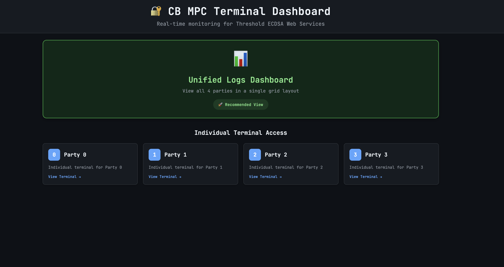
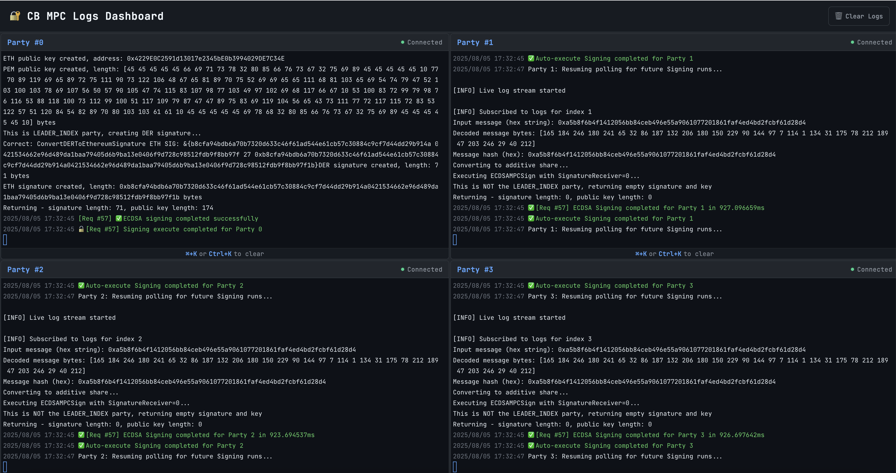

## CB MPC Terminal Dashboard

Real-time monitoring dashboard for **Threshold ECDSA Web Services** with 4-party MPC setup. Monitor signature operations and logs across all MPC parties.

## Live Demo

**Hosted:** [https://logs.cb-mpc.surge.dev/](https://logs.cb-mpc.surge.dev/)

## Screenshots





## ✨ Features

- **Unified Dashboard**: View all 4 parties in a grid layout
- **Individual Terminals**: Access dedicated terminals for each party
- **Real-time Streaming**: Live log updates via WebSocket connections
- **Auto-reconnection**: Automatic reconnection on connection loss
- **Keyboard Shortcuts**: Clear terminal with ⌘+K or Ctrl+K

## Quick Start

1. **Install dependencies:**
   ```bash
   npm install
   ```

2. **Start log streaming server:**
   ```bash
   node log-server.js
   ```

3. **Start the application:**
   ```bash
   npm run dev
   ```

4. **Access dashboard:**
   - Main: [http://localhost:3000](http://localhost:3000)
   - Unified view: `/terminal/logs`
   - Individual terminals: `/terminal/{0-3}`


---

**Built with ❤️ for secure MPC operations**
